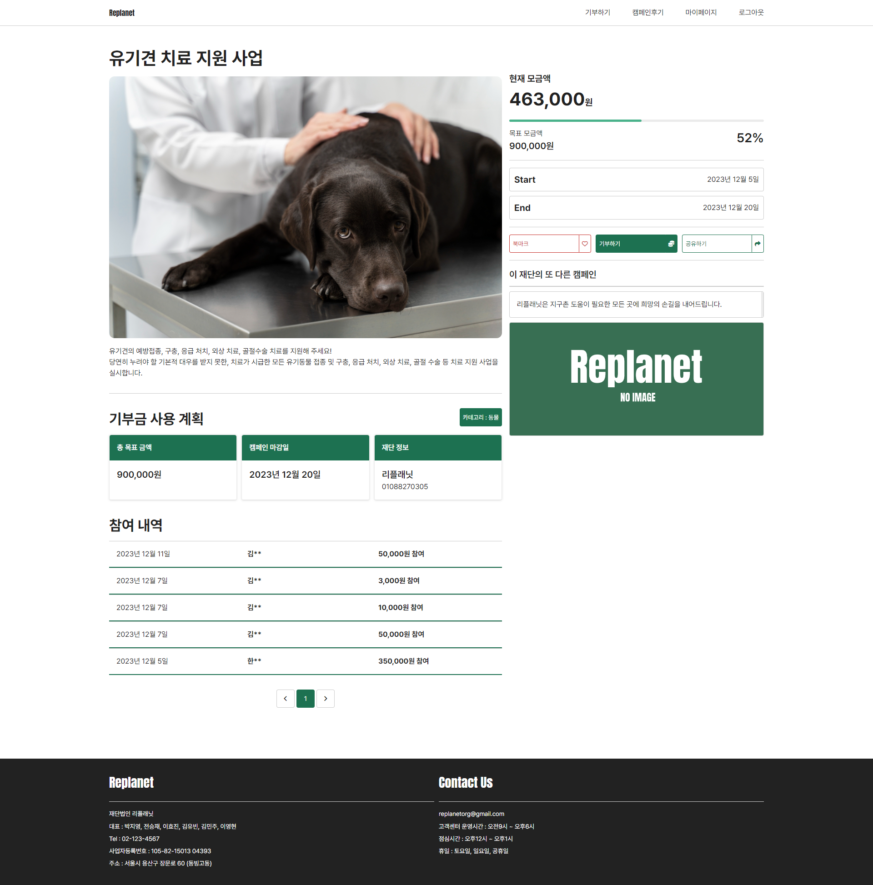
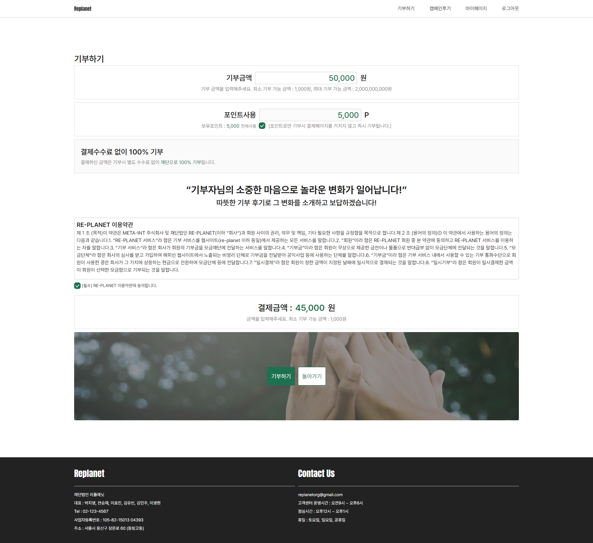
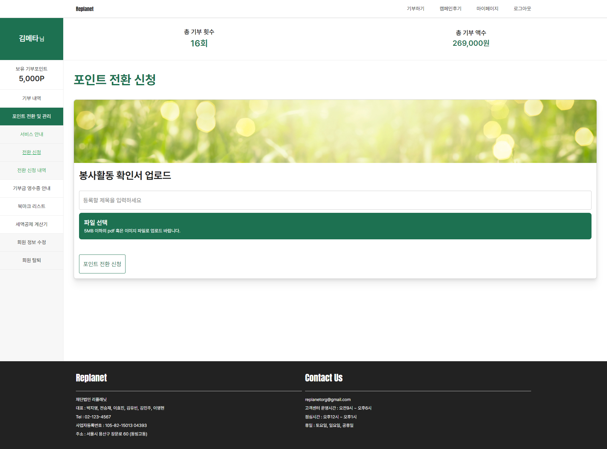

# REPLANET

<div align="center">


[](https://hits.seeyoufarm.com)

</div>

# REPLANET_RestAPI_V2
> **하이미디어 종로 캠퍼스 풀스택 자바 개발자 6회차** <br/> **개발기간: 2023.10 ~ 2023.12**

## 팀 소개 👨‍👨‍👧‍👧

|      김민주       |          김유빈         |       박지영         |       이영현         |       이효진         |       전승재         |                                                                                                               
| :------------------------------------------------------------------------------: | :---------------------------------------------------------------------------------------------------------------------------------------------------: | :---------------------------------------------------------------------------------------------------------------------------------------------------------------------------------------------------: | :------------------------------------------------------------------------------: | :------------------------------------------------------------------------------: | :------------------------------------------------------------------------------: | 
| JWT/Spring security<br/>(일반 회원)<br/>인증(e-mail, SMS),<br/>사이트 디자인 | 카카오페이 API<br/>(결제),<br/>카카오로그인 API<br/>(소셜 로그인) | 기부포인트 전환,<br/>마이페이지<br/>및<br/>회원 관리 | 캠페인 후기 관리, <br/> 댓글 | 기부 통계 관리,<br/>서포트봇 | 캠페인 관리 |
|   [@vaguewords](https://github.com/vaguewords)   |    [@peaknicc](https://github.com/peaknicc)  | [@jiyeong08](https://github.com/jiyeong08)  | [@Hanna Lee](https://github.com/babyybiss)  | [@Gray-Grazer](https://github.com/Gray-Grazer)  | [@Seung jae](https://github.com/wjs960)  |

## 프로젝트 소개 🖋

#### 봉사활동과 기부의 소중한 순간을 연결하다!
리플래닛은 사회적 문제 해결을 위해 힘을 모으고자 만들어졌습니다.<br/>
봉사활동과 기부를 연결지어 더 많은 기부의 활성화를 도모하는 리플래닛은 사회적 문제를 해결하고 새로운 도전에 동참하는 기회를 제공합니다.

## 시작 가이드 📑

#### Clone Path - RootFolder(Window : C, MacOS, Linux : User)\dev\metatint


### Installation
``` bash
$ git clone https://github.com/META-INT6/REPLANET_ResrAPI_V2.git
$ cd REPLANET_RestAPI_V2
```

### FrontEnd
⇨ [REPLANET_React_V2](https://github.com/META-INT6/REPLANET_React_V2.git)


---

## Environment 🐈


---
## 화면 구성 📺
| 메인 페이지  |  캠페인 페이지   |
| :-------------------------------------------: | :------------: |
|   |  |  
| 기부 페이지   |  포인트 전환 페이지   |  
|    |       |

---
## 주요 기능 📦

### 🌏 캠페인
- 기부 참여 현황 확인
- 카카오톡 공유 기능

### 🌏 기부(결제)
- 카카오페이 API 사용한 결제
- 포인트 사용한 결제

### 🌏 기부 포인트
- 봉사 활동 시간을 기부 포인트로 전환
